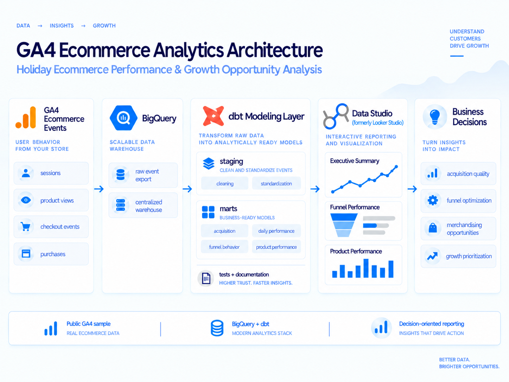

# Holiday Ecommerce Performance & Growth Opportunity Analysis

GA4 ecommerce analytics using BigQuery, dbt, and Data Studio to identify high-leverage opportunities across acquisition, conversion, and product performance.

[View the analysis report](https://docs.google.com/document/d/1YDcbx9SGObNGpedTLYqri0T7n7gApJKuDeseCUxaRpE/edit?usp=sharing)

## Executive Takeaway

The strongest growth opportunity is not simply acquiring more traffic.

The analysis points instead to improving early-funnel conversion, evaluating acquisition channels on traffic quality rather than volume alone, and allocating merchandising effort toward products that monetize attention efficiently.

With limited optimization capacity before the next peak season, the highest-priority opportunities are:

1. Early-funnel product and add-to-cart conversion
2. Acquisition-quality and paid-search diagnostics
3. Product-level merchandising efficiency
4. Behavioral segmentation using engagement as an intent signal

---

## Business Question

An ecommerce team is preparing for its next holiday planning cycle. Leadership has strong topline traffic and revenue data from the prior peak season, but limited clarity on where revenue was actually won or lost across acquisition, conversion, and product performance.

The analysis addresses a practical resource-allocation question:

> Where should limited marketing, merchandising, and conversion-optimization effort be focused before the next peak season?

The goal is to distinguish traffic volume from traffic quality, identify conversion leakage, evaluate how effectively products turn attention into revenue, and translate those findings into prioritized recommendations.

---

## Dataset

The project uses the public Google Merchandise Store GA4 ecommerce sample covering November 1, 2020 through January 31, 2021.

Across the 92-day analysis window:

| Metric | Value |
| Events | ~4.3 million |
| Users | ~270,000 |
| Sessions | ~360,000 |
| Transactions | ~4,450 |
| Purchase revenue | ~$307,000 |

The source data is event-level GA4 data stored in BigQuery.

---

## Tech Stack

- GA4 — event-level ecommerce data
- BigQuery — cloud data warehousing and SQL analysis
- dbt — transformation, modeling, testing, and reusable business logic
- Data Studio (formerly Looker Studio) — decision-oriented reporting and visualization
- Git / GitHub — version control and project documentation

---

## Analytical Architecture

The project separates source preparation, reusable transformation logic, analytical fact tables, and reporting-specific models so that core business logic is not embedded directly in the BI layer.

The modeling flow is:

GA4 events → BigQuery → dbt staging → intermediate models → analytical marts → reporting models → Data Studio

### Staging

Staging models clean and standardize raw GA4 fields while preserving source-level meaning.

### Intermediate

Intermediate models contain reusable transformation and business logic that should not be tied directly to a single dashboard or final analytical table.

### Analytical Marts

The primary fact tables organize the data around the project's major analytical subjects:

- `fct_daily_performance` — daily traffic, transactions, revenue, and conversion performance
- `fct_funnel_performance` — session behavior across key ecommerce funnel stages
- `fct_product_performance` — product demand, purchasing behavior, and revenue performance

### Reporting Layer

Reporting models reshape analytical outputs for specific visualization requirements without moving core calculations into Data Studio.

This keeps the reporting layer relatively thin while making calculations easier to test, reuse, and maintain.

---

## Reports

The final analysis is delivered through three decision-oriented reports.

| Report | Primary Purpose |
|---|---|
| [Executive Summary](https://datastudio.google.com/s/toBMze5zJ8s) | Overall ecommerce performance, acquisition, traffic and revenue trends, device behavior, and key commercial KPIs |
| [Funnel Performance](https://datastudio.google.com/reporting/ca2c8e85-095e-412c-bdc7-2912a6236e0f) | Stage progression, conversion leakage, engagement behavior, and funnel efficiency |
| [Product Performance](https://datastudio.google.com/reporting/c5249fd7-08c3-496e-bccc-2ddae51a7df9) | Product demand, revenue, purchasing behavior, monetization efficiency, and revenue distribution |

---

## Key Findings

### 1. Early-funnel leakage is the largest conversion opportunity

Only 5.2% of sessions that viewed a product ultimately reached purchase.

The largest early constraint occurs between product view and add to cart, where only 19.7% of product-view sessions progress. Once customers move deeper into the journey, progression becomes materially stronger.

The evidence therefore points toward product-detail and cart-intent formation as a higher-priority diagnostic area than broad late-stage checkout redesign.

---

### 2. Acquisition quality varies substantially by source

Organic and Direct generated the greatest scale among the major identifiable traffic sources, but traffic volume did not translate evenly into commercial value.

Google / Organic generated approximately 112,700 sessions and $83,300 in revenue, while Direct generated approximately 83,500 sessions and $68,200.

At the same time, reported conversion rate and revenue per session varied materially across sources.

This means acquisition decisions should incorporate downstream outcomes such as conversion and revenue efficiency rather than treating session volume as the primary measure of channel value.

Paid traffic in particular should be evaluated before additional investment is scaled.

---

### 3. Product attention and product monetization are not the same thing

High product-view volume does not consistently correspond to high revenue efficiency.

Some products monetize relatively limited exposure effectively, while others attract substantial attention without converting that attention into proportional revenue.

This creates two distinct opportunity types:

- High traffic + weak revenue efficiency — possible conversion friction, positioning problems, or weak product economics
- Lower traffic + strong revenue efficiency — possible underexposure and merchandising opportunity

A product opportunity matrix combining demand and monetization efficiency is therefore more useful than ranking products only by traffic or revenue.

---

### 4. Engagement is a strong signal of purchase intent

Purchase likelihood rises sharply with active engagement time:

| Active Engagement | Purchase Rate |
|---|---:|
| 1–3 minutes | ~0.6% |
| 3–10 minutes | ~6.7% |
| 10+ minutes | ~23.8% |

This relationship should not be interpreted causally. The analysis does not establish that increasing session duration will cause customers to purchase.

Instead, engagement is most useful as a predictive and diagnostic signal that could support behavioral segmentation, remarketing, propensity modeling, or targeted onsite interventions.

The objective is to recognize high-intent behavior, not artificially increase time on site.

---

## Supporting Findings

### Revenue is diversified across the product portfolio

No single product dominates overall revenue.

The top 10 products generated approximately 23% of revenue, and roughly 36 products were required to reach 50% of total revenue.

This suggests that merchandising strategy should not depend on finding or promoting a single hero product.

---

### Mobile does not appear to be the primary aggregate performance problem

Desktop generates substantially more traffic and revenue, but aggregate mobile performance is slightly stronger on both conversion rate and revenue per session.

That makes a broad mobile redesign a lower-priority starting point than the larger early-funnel and acquisition-quality opportunities identified elsewhere in the analysis.

Device-level behavior remains worth monitoring, but the aggregate evidence does not indicate an obvious mobile conversion crisis.

---

### Demand is concentrated around the peak holiday window

Revenue and transaction activity are strongest from Cyber Monday through mid-December before declining later in the holiday period.

For future peak-season planning, major acquisition, merchandising, and conversion initiatives should therefore be ready before peak demand arrives, rather than deployed reactively during it.

---

## Recommendations

### 1. Prioritize early-funnel product and add-to-cart conversion

Investigate why a large share of product interest fails to progress into cart intent.

Initial areas to evaluate include:

- product-page clarity and merchandising
- pricing and offer presentation
- add-to-cart CTA behavior
- high-traffic products with weak cart progression
- differences in early-funnel performance by acquisition source

Where the cause is uncertain, use controlled experimentation rather than assuming the issue is purely UX-related.

---

### 2. Evaluate acquisition based on traffic quality

Use conversion and revenue performance alongside session volume when prioritizing acquisition channels.

Specific next steps include:

- protect large, productive Organic and Direct traffic sources
- audit paid-search targeting and landing-page alignment
- evaluate paid traffic against revenue per session and campaign economics
- validate unusually strong referral attribution before using it for budget allocation

More traffic is not automatically more valuable traffic.

---

### 3. Prioritize products using both demand and monetization efficiency

Do not rank products only by revenue or traffic.

Evaluate products across metrics such as:

- product views
- cart behavior
- purchase behavior
- revenue per view
- unit sales
- total revenue contribution

This makes it possible to distinguish high-demand products with monetization friction from efficient products that may deserve additional exposure.

---

### 4. Use engagement as an intent signal

Investigate the behaviors associated with highly engaged purchasers and determine whether they can support:

- remarketing audiences
- behavioral segmentation
- purchase-propensity models
- targeted onsite interventions

The goal should be to identify high-intent customer behavior rather than optimize session duration as an end in itself.

---

## Data Quality and Validation

Custom dbt tests validate important modeling assumptions, including:

- daily-performance grain
- funnel-performance grain
- product-performance grain
- product metric integrity
- revenue reconciliation

These checks help ensure that reporting outputs preserve their intended grain and that revenue remains consistent across analytical layers.

The project also surfaced cases where item revenue appears without a corresponding recorded product-view event.

Rather than treating event-level behavioral data as inherently complete, the analysis treats measurement validation as part of the analytics system itself.

---

## Cost-Aware Development

The project uses configurable `ga4_start_date` and `ga4_end_date` variables to control the GA4 source-table range.

Development began with the four-day Black Friday through Cyber Monday window. This provided a small but behaviorally rich dataset for validating:

- model grain
- transaction deduplication
- funnel logic
- product identity
- metric calculations

Using the reduced development window lowered typical query scans from roughly 1.5 GB to about 100 MB, allowing modeling logic to be iterated on at a fraction of the full-data query cost.

After validation, the project was expanded to the complete 2020-11-01 through 2021-01-31 analysis window.

BigQuery usage was monitored through `INFORMATION_SCHEMA.JOBS_BY_PROJECT` to track query volume, bytes processed, and bytes billed during development.

---

## Analytical Design Principles

Several principles guided the implementation:

- Preserve additive components so rates can be recalculated correctly at different reporting grains.
- Keep core business logic outside the BI layer.
- Use reporting models only for presentation-specific transformations.
- Explicitly validate model grain and reconcile revenue across layers.
- Design visualizations around decision-relevant business implications rather than isolated metrics.

---

## Repository Guide

The main areas of the repository are:

- `models/` — dbt staging, intermediate, mart, and reporting models
- `analyses/` — supporting analytical queries used to investigate business questions
- `tests/` — custom assertions for grain, metric integrity, and revenue reconciliation
- `macros/` — reusable dbt logic
- `dbt_project.yml` — dbt project configuration

For a technical review, the analytical marts and custom tests provide the clearest view into the project's modeling and validation approach.

---

## Limitations and Production Extensions

This analysis uses a public GA4 sample and therefore does not contain several inputs that would normally influence production recommendations.

Important missing dimensions include:

- advertising cost and campaign-level ROAS
- product margin
- inventory constraints
- customer-level profitability
- repeat-purchase behavior
- experimentation outcomes
- richer attribution and landing-page context

The findings should therefore be treated as prioritization signals rather than proof of causality.

In a production environment, the analysis could be extended by joining campaign economics, product margin and inventory data, customer behavior, and richer attribution dimensions.

Those additions would move the analysis from identifying where to investigate toward estimating which intervention is likely to produce the highest incremental return.